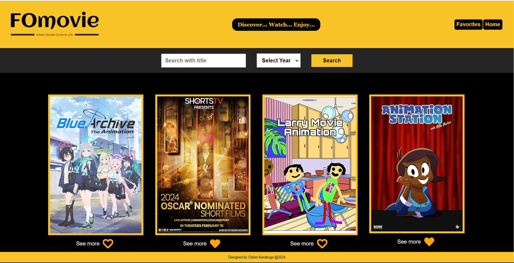
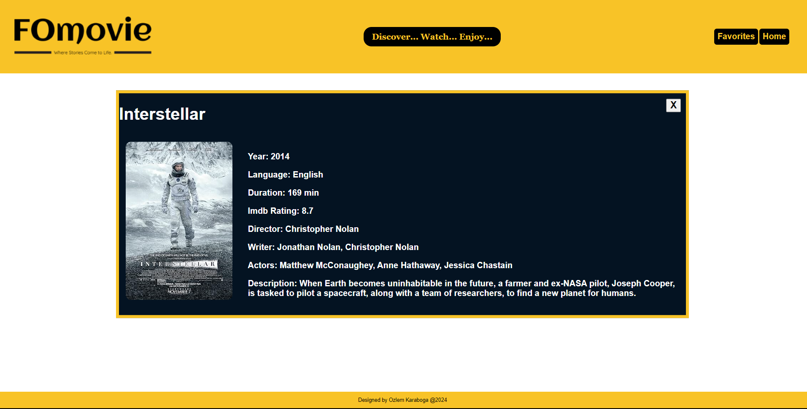
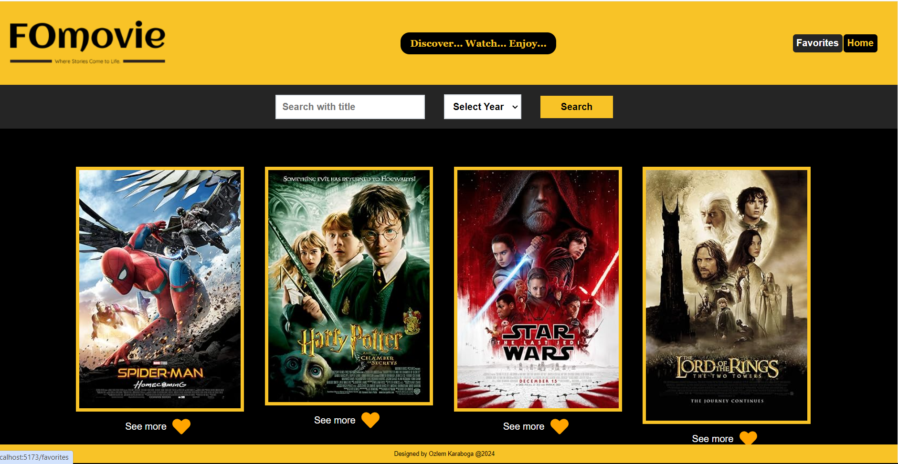

# FOmovie-REACT







## Project Overview

FOmovie is a movie search website built using React. Users can search for movies based on their titles, filter movies by years, and select their favorite films. The platform offers a seamless experience for users to explore and discover movies of interest. Explore, filter, and save your favorite movies with ease on FOmovie.

[Click here for the Demo version](https://transcendent-daffodil-94ac9c.netlify.app/)

### Technologies

- REACT
- CONTEXT API
- React Router

### Project Setup

To get started you can simply clone the repo and install the dependencies in the root folder

| Steps   |with [NPM](https://www.npmjs.com/) |
| ------- | --------------------------------- |
| Install |`npm install`                      |
| Run     |`npm run dev`                      |

### Installation

 Clone the repository :

```
git clone <https://github.com/OzlemKaraboga/FOmovie-React.git>
```

## Used API

The application utilizes the [OMDb API](https://www.omdbapi.com) for fetching movie information.
